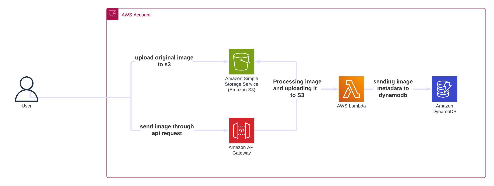

# Serverless Image Processing Project

## Overview
This project is a serverless image processing application where users upload images to an S3 bucket. This triggers an AWS Lambda function that processes and resizes the images before storing them in another S3 bucket.

## Architecture

- **Amazon S3**: S3 bucket is used, one for original images and for processed/resized images.
- **AWS Lambda**: Function to process images (resize, watermark).
- **IAM Roles and Policies**: For Lambda execution and S3 access.
- **DynamoDB**: A table to store image metadata.
- **API Gateway**: Can be added to expose an API for uploads.

## How does the code work
The Lambda function serves as a **dual-purpose image processor** that can handle both S3-triggered events and direct API Gateway requests for image upload and processing.

  ### Key Features
  -  **Dual Event Handler** → Processes both S3 bucket events and API Gateway HTTP requests
  -  **Image Resizing** → Automatically resizes images to 800px width while maintaining aspect ratio
  -  **Metadata Storage** → Stores processing metadata in DynamoDB table
  -  **Format Preservation** → Maintains original image format during resizing operations
  -  **Error Handling** → Comprehensive error handling with detailed logging
  -  **Environment Configuration** → Uses environment variables for flexible deployment

## Deployment
- Uses Terraform to define infrastructure.
- Uses GitHub Actions for CI/CD to deploy Terraform changes automatically.
- Uses Github Actions to destroy the IAC after testing the deployment.

## How to Use
1. Upload images to the `original-images-bucket-study` S3 bucket.
2. Lambda automatically processes and stores resized images in the `processed-images-bucket-study` bucket.
3. Store metadata in DynamoDB if needed.

## Requirements
- AWS CLI configured with appropriate permissions.
- Terraform installed.
- GitHub repository set up with Terraform files and GitHub Actions workflow.
